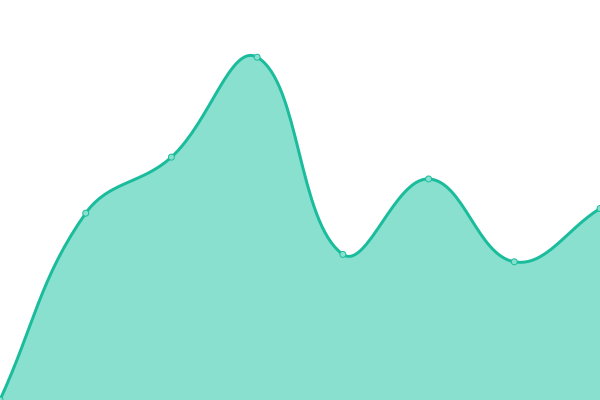

# [📈 Live Status](https://status.fullprofile.com.au): <!--live status--> **🟩 All systems operational**

This repository contains the open-source uptime monitor and status page for [AgriDigital](agridigital.io), powered by [Upptime](https://github.com/upptime/upptime).

With [Upptime](https://upptime.js.org), you can get your own unlimited and free uptime monitor and status page, powered entirely by a GitHub repository. We use [Issues](https://github.com/fullprofile/fullprofile-status-monitor/issues) as incident reports, [Actions](https://github.com/fullprofile/fullprofile-status-monitor/actions) as uptime monitors, and [Pages](https://status.fullprofile.com.au) for the status page.

<!--start: status pages-->
<!-- This summary is generated by Upptime (https://github.com/upptime/upptime) -->
<!-- Do not edit this manually, your changes will be overwritten -->
<!-- prettier-ignore -->
| URL | Status | History | Response Time | Uptime |
| --- | ------ | ------- | ------------- | ------ |
|  Broker Platform | 🟩 Up | [broker-platform.yml](https://github.com/fullprofile/fullprofile-status-monitor/commits/HEAD/history/broker-platform.yml) | 

 2746ms
     
 | 

<a href="https://status.fullprofile.com.au/history/broker-platform">100.00%</a>
    

|  Broker Auth | 🟩 Up | [broker-auth.yml](https://github.com/fullprofile/fullprofile-status-monitor/commits/HEAD/history/broker-auth.yml) | 

 232ms
     
 | 

<a href="https://status.fullprofile.com.au/history/broker-auth">100.00%</a>
    

|  [Broker Xero API](https://xero-api.fullprofile.net/api/health) | 🟩 Up | [broker-xero-api.yml](https://github.com/fullprofile/fullprofile-status-monitor/commits/HEAD/history/broker-xero-api.yml) | 

 904ms
     
 | 

<a href="https://status.fullprofile.com.au/history/broker-xero-api">100.00%</a>
    

<!--end: status pages-->

[**Visit our status website →**](https://status.fullprofile.com.au)

## 📄 License

- Powered by: [Upptime](https://github.com/upptime/upptime)
- Code: [MIT](./LICENSE) © [AgriDigital](agridigital.io)
- Data in the `./history` directory: [Open Database License](https://opendatacommons.org/licenses/odbl/1-0/)
